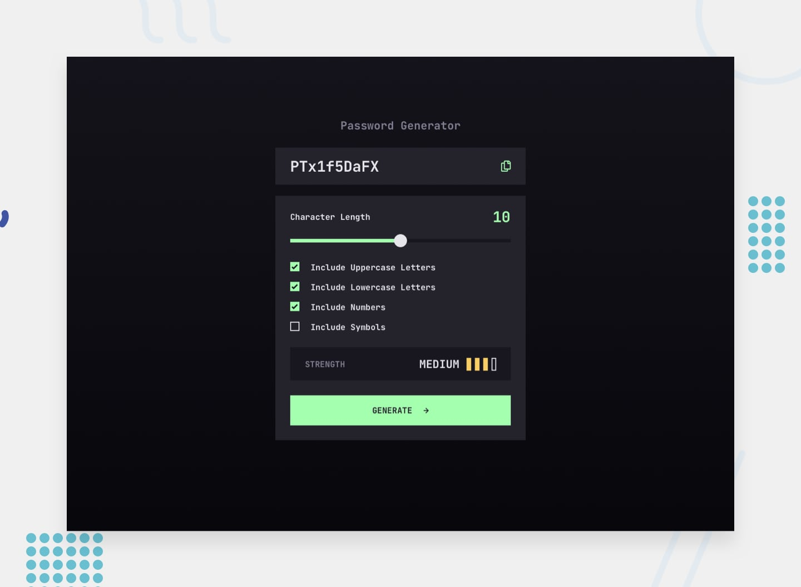

# Password Generator App



### Description
This project lets you generate a random, strong password. Passwords that can have various combination of characters upto the length of 20.

You can check the strength of the generated password scored by a popular library [zxcvbn](https://github.com/dropbox/zxcvbn). Passwords are never stored neither on your device nor into any servers, no network calls are made.

#### [Live Demo](https://password-generator-towkir.vercel.app/)

### Features
This project offers a few really really simple features, such as:
- Control the characters you want to include in your password
- Control the length of the password
- Generate the password (obviously)
- See a strength score instantly after generating the password

#### About
GitHub Repo can be found [here](https://github.com/towkir/password-generator/) (if you're not already viewing this from github).


---

#### Project Setup Instructions
This project was created with Vite and React.

Install dependencies:
```
npm install
```


Run the app in the development mode:
```
npm run dev
```

Build the app for production:
```
npm run build
```
*Feel free to contribute, fix bugs, or provide feedback*

---

> N.B. If you serve this project locally over `http`, the copy password feature might not work, because the clipboard api is sensitive to security. But it works expected once it's hosted through https.
